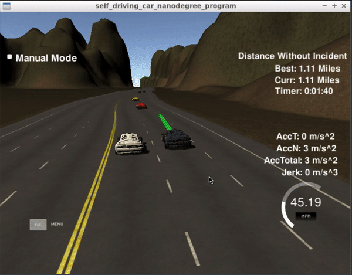
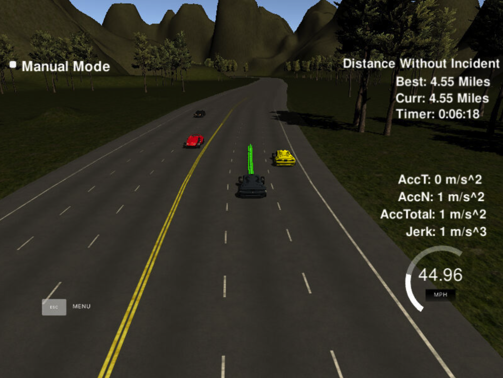
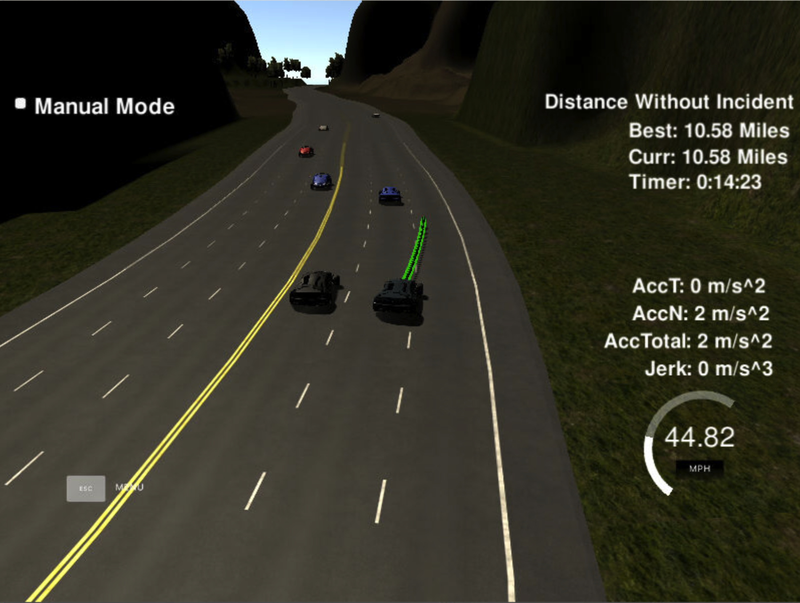

# CarND-Path-Planning-Project
Self-Driving Car Engineer Nanodegree Program

---
## Introduction



In this project your goal is to safely navigate around a virtual highway with other traffic that is driving +-10 MPH of the 50 MPH speed limit. Car's localization and sensor fusion data will be provided, there is also a sparse map list of waypoints around the highway. The car should try to go as close as possible to the 50 MPH speed limit, which means passing slower traffic when possible, note that other cars will try to change lanes too. The car should avoid hitting other cars at all cost as well as driving inside of the marked road lanes at all times, unless going from one lane to another. The car should be able to make one complete loop around the 6946m highway. Since the car is trying to go 50 MPH, it should take a little over 5 minutes to complete 1 loop. Also the car should not experience total acceleration over 10 m/s^2 and jerk that is greater than 10 m/s^3.

To justify these objectives, I developed a the path planning algorithm as follows:

1. Prediction
2. Behavior planner
3. Trajectory generation

## Implementation
### Prediction

Prediction algorithm gathers infromation from telemetry and sensor fusion data to sense the environment. Based on the data other cars' position is calculated. Safe distance between ego vehicle and `30 meters` for cars ahead and `15 meters` for cars behind is always kept. When safe distance crtiteria is satisfied then only lane change is allowed if required.

### Behavior planner

Driving is fairly easy and structural on highways. Behavior planner make decision about lane keeping, changing lane to left/right and slowing down. Behavior planner output is based on the prediction algorithm output. 

```c++
// Step 2: Behavior planner
            const double max_speed = 49;
            const double max_acc = .224;{.center}{.center}
            
            if (front_car) { // There is car ahead of ego vehicle
                if (!leftlane_car && lane > 0) { // left lane present and no car in left lane
                    lane--; // Change lane
                }
                else if (!rightlane_car && lane !=2) { // right lane present and no car in right lane
                    lane++; // Change lane
                }
                else {
                    initial_vel -= max_acc;
                }
            }
            else {
                if (lane != 1) { // Ego vehicle is not in the center lane
                    if ((lane == 0 && !rightlane_car) || (lane == 2 && !leftlane_car)) {
                        lane = 1; // Steer back to center lane
                    }
                }
                if (initial_vel < max_speed) {
                    initial_vel += max_acc;
                }
            }
```

### Trajectory generation

Trajectory is generated based on ego vehicle's speed, coordinates and behavior planner output. Initially ego vehicle's position is taken as reference point and then last two points of previous trajectory are used to initialize the spline. To ensure the continuity of trajectory previous trajectory points are copied to new trajectory.

Speed change is decided in the behavior planning algorithm and implemented on every point of trajectory instead of complete trajectory.

```c++
pt_x[i] = shift_x * cos(0 - ref_yaw) - shift_y * sin(0 - ref_yaw);
pt_y[i] = shift_x * sin(0 - ref_yaw) + shift_y * cos(0 - ref_yaw);
```


## Conclusion

It is fairly possible to drive without difficulty in all traffic consditions and when there is a safe path available with speed close to `max_speed`, ego vehicle changes lane. In simulator car drove close to `11 miles` in 15 minutes without an incident.




# Udacity README   
### Simulator.
You can download the Term3 Simulator which contains the Path Planning Project from the [releases tab (https://github.com/udacity/self-driving-car-sim/releases/tag/T3_v1.2).  

To run the simulator on Mac/Linux, first make the binary file executable with the following command:
```shell
sudo chmod u+x {simulator_file_name}
```

## Dependencies

* cmake >= 3.5
  * All OSes: [click here for installation instructions](https://cmake.org/install/)
* make >= 4.1
  * Linux: make is installed by default on most Linux distros
  * Mac: [install Xcode command line tools to get make](https://developer.apple.com/xcode/features/)
  * Windows: [Click here for installation instructions](http://gnuwin32.sourceforge.net/packages/make.htm)
* gcc/g++ >= 5.4
  * Linux: gcc / g++ is installed by default on most Linux distros
  * Mac: same deal as make - [install Xcode command line tools]((https://developer.apple.com/xcode/features/)
  * Windows: recommend using [MinGW](http://www.mingw.org/)
* [uWebSockets](https://github.com/uWebSockets/uWebSockets)
  * Run either `install-mac.sh` or `install-ubuntu.sh`.
  * If you install from source, checkout to commit `e94b6e1`, i.e.
    ```
    git clone https://github.com/uWebSockets/uWebSockets 
    cd uWebSockets
    git checkout e94b6e1
    ```

## Editor Settings

We've purposefully kept editor configuration files out of this repo in order to
keep it as simple and environment agnostic as possible. However, we recommend
using the following settings:

* indent using spaces
* set tab width to 2 spaces (keeps the matrices in source code aligned)

## Code Style

Please (do your best to) stick to [Google's C++ style guide](https://google.github.io/styleguide/cppguide.html).

## Project Instructions and Rubric

Note: regardless of the changes you make, your project must be buildable using
cmake and make!


## Call for IDE Profiles Pull Requests

Help your fellow students!

We decided to create Makefiles with cmake to keep this project as platform
agnostic as possible. Similarly, we omitted IDE profiles in order to ensure
that students don't feel pressured to use one IDE or another.

However! I'd love to help people get up and running with their IDEs of choice.
If you've created a profile for an IDE that you think other students would
appreciate, we'd love to have you add the requisite profile files and
instructions to ide_profiles/. For example if you wanted to add a VS Code
profile, you'd add:

* /ide_profiles/vscode/.vscode
* /ide_profiles/vscode/README.md

The README should explain what the profile does, how to take advantage of it,
and how to install it.

Frankly, I've never been involved in a project with multiple IDE profiles
before. I believe the best way to handle this would be to keep them out of the
repo root to avoid clutter. My expectation is that most profiles will include
instructions to copy files to a new location to get picked up by the IDE, but
that's just a guess.

One last note here: regardless of the IDE used, every submitted project must
still be compilable with cmake and make./

## How to write a README
A well written README file can enhance your project and portfolio.  Develop your abilities to create professional README files by completing [this free course](https://www.udacity.com/course/writing-readmes--ud777).

